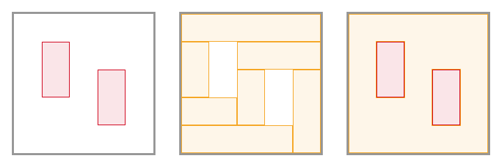

# Gap Grid

This library was originaly created for [Backdrop](https://github.com/fczbkk/Backdrop). But it is abstract and has no requirements, so it can be used anywhere else. Let's see what it does:



It starts with a block (canvas) containing other blocks (gaps). Then it finds minimum number of blocks to fill out whole canvas around the gaps without overlaps.

## How to use it

```javascript
// create instance
var my_gap_grid = new GapGrid();

// set canvas box
my_gap_grid.setCanvas({left: 0, top: 0, width: 500, height: 500});

// add gap boxes
my_gap_grid.addGap({left: 100, top: 100, width: 100, height: 200});
my_gap_grid.addGap({left: 300, top: 200, width: 100, height: 200});

// get list of cover boxes
var cover_boxes = my_gap_grid.generate();
```

Or you can use equivalent shorthand version:

```javascript
var my_gap_grid = new GapGrid({left: 0, top: 0, width: 500, height: 500}, [
  {left: 100, top: 100, width: 100, height: 200},
  {left: 300, top: 200, width: 100, height: 200}
]);
var cover_boxes = my_gap_grid.generate();
```

### Constructor

```javascript
new GapGrid(canvas_box, gap_boxes)
```

- **canvas_box** - Box object representing the area which you want to cover.
- **gap_boxes** - Array of box objects representing areas which should not be covered.

### Methods

#### setCanvas(box)

Sets canvas box.

```javascript
my_gap_grid.setCanvas({left: 0, top: 0, width: 500, height: 500});
```

#### generate()

Returns an array containing box objects. It should represent the minimum number of boxes that, if combined, will cover the whole area of canvas box, without overlaping and without covering areas of gap boxes.

#### addGap(box)

Adds a single gap box to the list of gap boxes.

```javascript
my_gap_grid.addGap({left: 100, top: 100, width: 100, height: 200});
```

#### addGaps([box1, box2, ...])

Adds multiple gap boxes at once.

```javascript
my_gap_grid.addGaps([
  {left: 100, top: 100, width: 100, height: 200},
  {left: 300, top: 200, width: 100, height: 200}
]);

// it is equivalent to this
my_gap_grid.addGap({left: 100, top: 100, width: 100, height: 200});
my_gap_grid.addGap({left: 300, top: 200, width: 100, height: 200});
```

#### removeGap(box)

Removes a single gap box from the list of gap boxes.

```javascript
my_gap_grid.removeGap({left: 100, top: 100, width: 100, height: 200});
```

#### removeGaps([box1, box2, ...])

Removes multiple gap boxes at once.

```javascript
my_gap_grid.removeGaps([
  {left: 100, top: 100, width: 100, height: 200},
  {left: 300, top: 200, width: 100, height: 200}
]);

// it is equivalent to this
my_gap_grid.removeGap({left: 100, top: 100, width: 100, height: 200});
my_gap_grid.removeGap({left: 300, top: 200, width: 100, height: 200});
```

#### clearGaps()

Removes all the gap boxes.

### Box object

The library uses a simple data object to describe boxes (canvas, gaps, covers):

```javascript
{
  left:   100,
  top:    100,
  width:  100,
  height: 100
}
```

It is abstract, it does not use any units. All positions are absolute.

## Bug reports, feature requests and contact

If you found any bugs, if you have feature requests or any questions, please, either [file an issue at GitHub](https://github.com/fczbkk/gap-grid/issues) or send me an e-mail at [riki@fczbkk.com](mailto:riki@fczbkk.com).


## License

Gap Grid is published under the [MIT license](https://github.com/fczbkk/gap-grid/blob/master/LICENSE).
